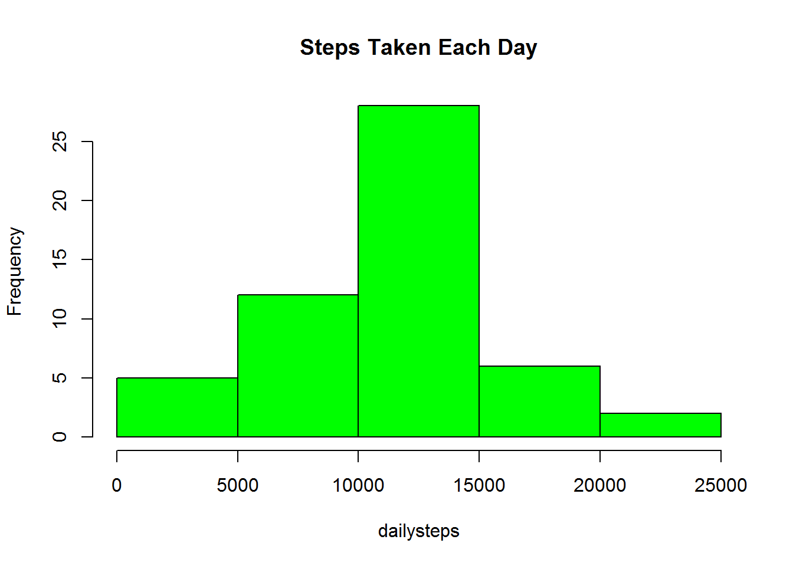
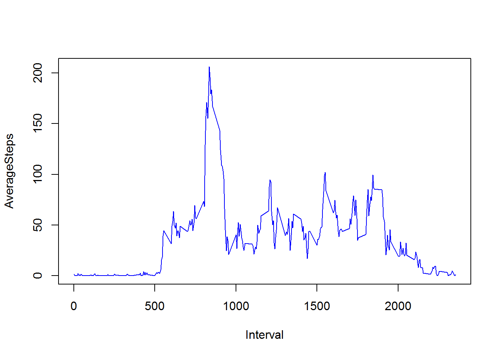
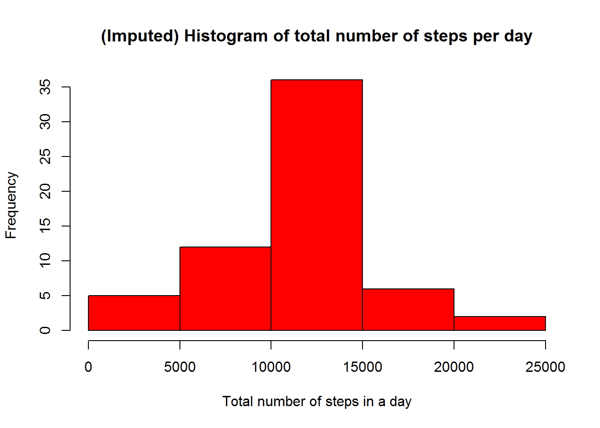
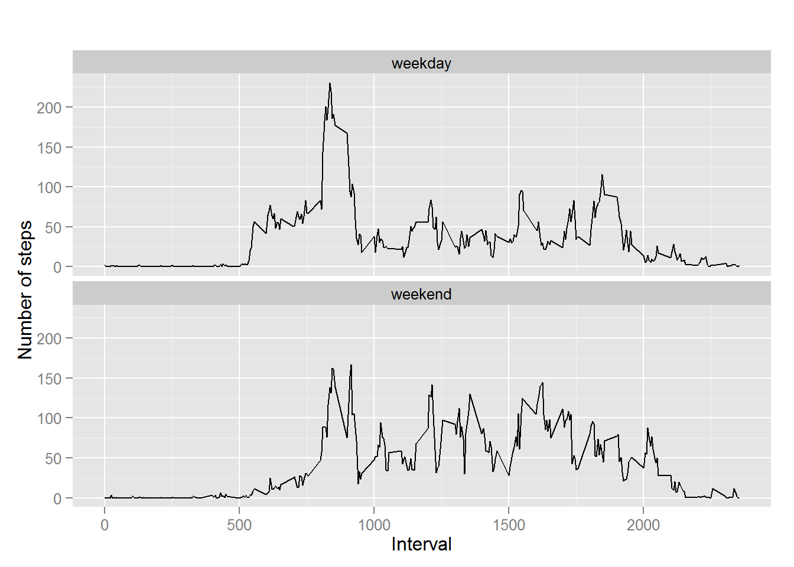

**Introduction**  
It is now possible to collect a large amount of data about personal movement using activity monitoring devices such as a Fitbit, Nike Fuelband, or Jawbone Up. These type of devices are part of the "quantified self" movement - a group of enthusiasts who take measurements about themselves regularly to improve their health, to find patterns in their behavior, or because they are tech geeks. But these data remain under-utilized both because the raw data are hard to obtain and there is a lack of statistical methods and software for processing and interpreting the data.

This assignment makes use of data from a personal activity monitoring device. This device collects data at 5 minute intervals through out the day. The data consists of two months of data from an anonymous individual collected during the months of October and November, 2012 and include the number of steps taken in 5 minute intervals each day.

**Load the Data and Process if necessary**   


```r
Activity <- read.table(file="Activity.csv",sep=",",header = TRUE)
head(Activity)
```

```
##   steps       date interval
## 1    NA 2012-10-01        0
## 2    NA 2012-10-01        5
## 3    NA 2012-10-01       10
## 4    NA 2012-10-01       15
## 5    NA 2012-10-01       20
## 6    NA 2012-10-01       25
```
We can observe we have three columns Steps,Date,Interval indicates no of steps taken on that day for that Interval.
 
**Mean Total number of Steps taken per day*
  * Calculate the total number of steps taken per day  

```r
dailysteps <- tapply(Activity$steps, Activity$date, sum)
```

  * Create a histogram to see Total number of steps per day 


```r
hist<-hist(dailysteps,col='green' , main='Steps Taken Each Day')
```



  * Calculate and report the mean and median of the total number of steps taken per day  

```r
mean(dailysteps,na.rm=TRUE)
```

```
## [1] 10766.19
```

```r
median(dailysteps,na.rm =TRUE)
```

```
## [1] 10765
```
**Average Steps taken daily per interval**  
  * Time Series plot of type="l"  

```r
averageActivitySteps<-aggregate(steps~interval,Activity,mean)
plot(averageActivitySteps$interval,averageActivitySteps$steps,type="l",col='Blue', xlab='Interval',ylab='AverageSteps')
```



* Calculating Maximum no of Steps on average 5 minutes interval
  

```r
max_row_id<-which.max(averageActivitySteps$steps)
averageActivitySteps[max_row_id, ]
```

```
##     interval    steps
## 104      835 206.1698
```
It is the 8:35 Interval
 
 
**Imputing missing values** 

  * Calculate and report the total number of missing values in the dataset (i.e. the total number of rows with NAs)


```r
  Totalnulls<-Activity[!complete.cases(Activity),]
  nrow(Totalnulls)
```

```
## [1] 2304
```
We loop across the rows of the data frame "df". If the steps value is NA for a row, we find the corresponding value of interval. We then look up the steps value from the other data frame "table_interval_steps" for this value of interval and replace the NA value with it.


```r
for (i in 1:nrow(Activity)){
  if (is.na(Activity$steps[i])){
    interval_val <- Activity$interval[i]
    row_id <- which(averageActivitySteps$interval == interval_val)
    steps_val <- averageActivitySteps$steps[row_id]
    Activity$steps[i] <- steps_val
  }
}

# aggregate steps as per date to get total number of steps in a day
imputed<-aggregate(steps~date,Activity,sum)

# create histogram of total number of steps in a day
hist(imputed$steps, col='red', main="(Imputed) Histogram of total number of steps per day", xlab="Total number of steps in a day")
```



  * Calculate the Mean and Median of Imputed values
  

```r
mean(imputed$steps)
```

```
## [1] 10766.19
```

```r
median(imputed$steps)
```

```
## [1] 10766.19
```
We can observe that Mean ,Median remians the same event afer Imputing.

***Observing the Patterns on Week Days and Week Ends ***
  * Create a new factor variable in the dataset with two levels - "weekday" and "weekend" indicating whether a given date is a weekday or weekend day

```r
Activity$date <- as.Date(Activity$date, "%Y-%m-%d")

# add a new column indicating day of the week 
Activity$day <- weekdays(Activity$date)

# add a new column called day type and initialize to weekday

Activity$day_type <- c("weekday")

# If day is Saturday or Sunday, make day_type as weekend
for (i in 1:nrow(Activity)){
  if (Activity$day[i] == "Saturday" || Activity$day[i] == "Sunday"){
    Activity$day_type[i] <- "weekend"
  }
}

# convert day_time from character to factor
Activity$day_type <- as.factor(Activity$day_type)
```

 * Make a panel plot containing a time series plot (i.e. type = "l") of the 5-minute interval (x-axis) and the average number of steps taken, averaged across all weekday days or weekend days (y-axis). See the README file in the GitHub repository to see an example of what this plot should look like using simulated data.  
 

```r
# aggregate steps as interval to get average number of steps in an interval across all days
table_interval_steps_imputed <- aggregate(steps ~ interval+day_type, Activity, mean)

# make the panel plot for weekdays and weekends
library(ggplot2)
qplot(interval, steps, data=table_interval_steps_imputed, geom=c("line"), xlab="Interval", 
      ylab="Number of steps", main="") + facet_wrap(~ day_type, ncol=1)
```



This concludes that people are more lazy on Weekends rather then Weekdays.

